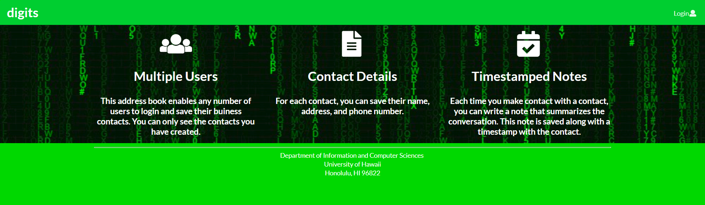
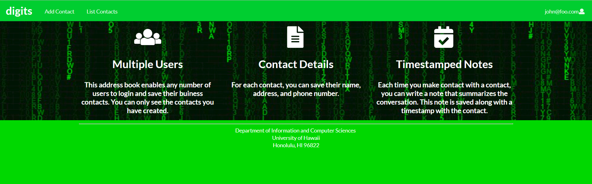
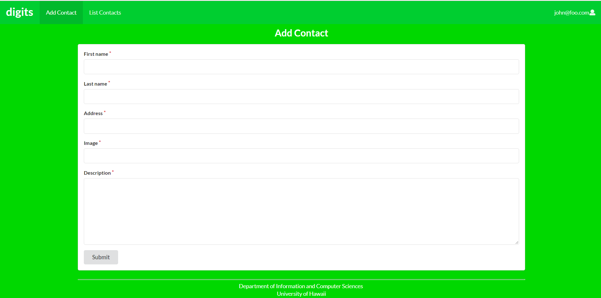
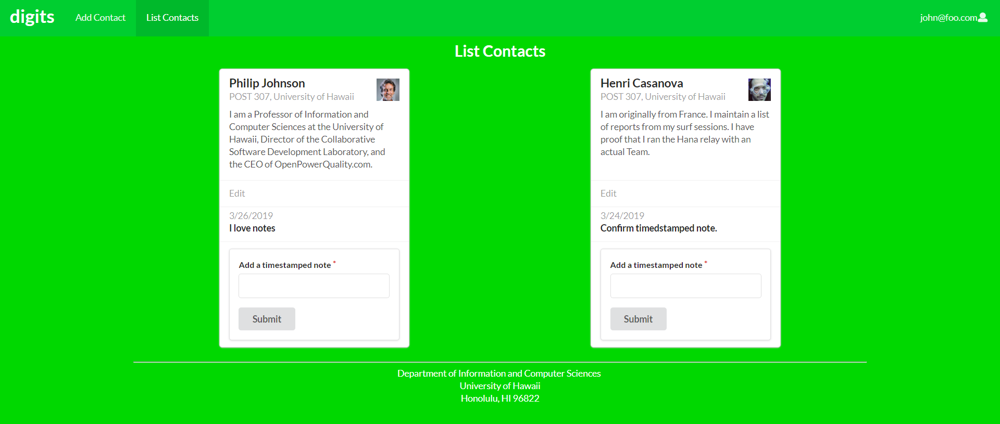
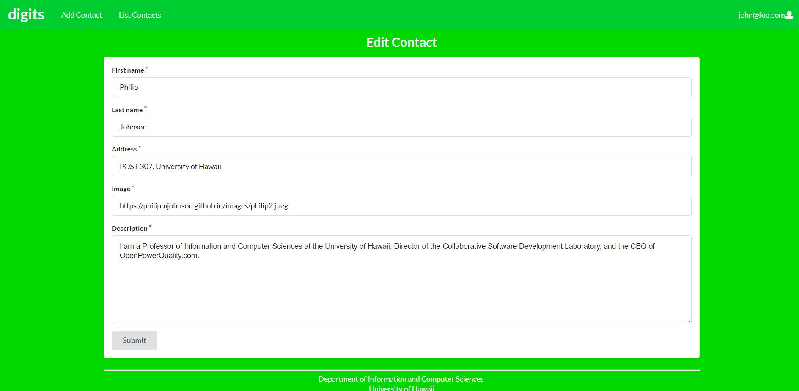
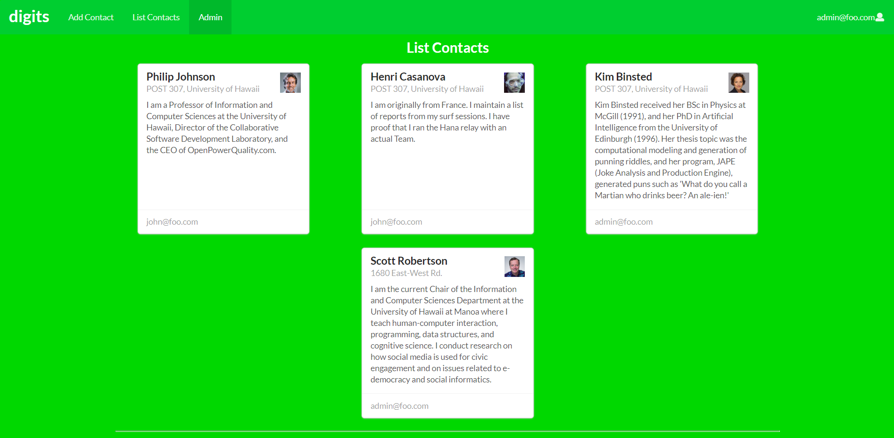

Digits is an application that allows users to:
<ul>
  <li>Register and account.</li>
  <li>Create and manage a set of contacts.</li>
  <li>Add a set of timestamped notes regarding their interactions with each contact.</li>
</ul>

**Installation**

<ol>
  <li>Install <a href="https://www.meteor.com/install">Meteor.</a></li>
  <li><a href="https://github.com/keonifontanilla/digits">Download a copy of Digits.</a> 
  Digits is a private repo so you must ask for permission to gain access.</li>
  <li><pre>
    meteor npm install
  </pre></li>
</ol>

